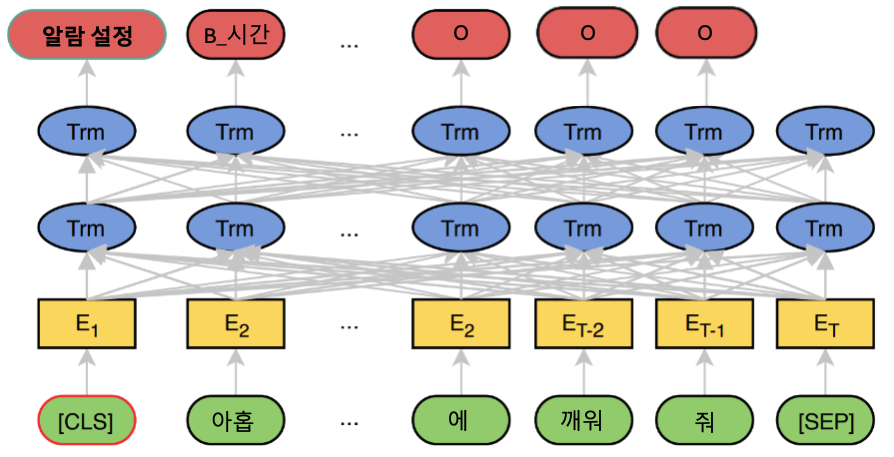

# [오케스트로] Intent Classification & Slot Filling

해당 프로젝트는 **Intent Classification**과 **Slot Filling**을 위해 JointBERT 모델을 활용합니다. 
<br/>
Amazon-massive Dataset과 AI Hub 한국어 대화 Dataset을 결합하여, 한국어 환경에서의 효과적인 정보 추출을 목표로 합니다.

<br/>

## Model Architecture


<p float="left" align="center">
    
</p>

- 하나의 BERT 모델에서 **intent**와 **slot**을 동시에 예측
- **total_loss**: `total_loss = intent_loss + coef * slot_loss` (옵션 `--slot_loss_coef`으로 coef 조정 가능)
- **CRF 레이어**: CRF 레이어를 사용하려면 `--use_crf` 옵션 추가


<br/>

## Dependencies (작업 환경)

- python >= 3.6
- torch == 1.6.0
- transformers == 3.0.2
- seqeval == 0.0.12
- pytorch-crf == 0.7.2


<br/>

## Dataset

|                 | Intent 수  | Slot 수  | 최종 데이터 수 | 
| --------------- | ---------- | -------- | -------------- |
| Amazon Massive  |     60     |   55     |    11,082      | 
| AI Hub 한국어 대화 |     12     |   36     |     7,520      | 
| 최종 Train      |     72     |   87    |    14,881      | 
| 최종 Valid      |     66     |   83     |     1,860      | 
| 최종 Test       |     68     |   83     |     1,861      | 

- 데이터를 shuffle한 뒤, train, valid, test dataset을 8:1:1 비율로 분할

<br/>

**JointBERT 모델에 맞춰 한국어 데이터셋을 전처리하기 위해 관련 코드 추가**

- `korean_to_json.py` : 엑셀 형태의 AI Hub 한국어 대화 Dataset을 JSON 파일로 변환하고, 도메인별로 train, valid, test dataset을 구축  
  * AI Hub 한국어 대화 Dataset을 JSON으로 변환

- `amazon+korean_to_json.py` : `korean_to_json.py` 파일을 불러온 뒤, 엑셀 형태의 AI Hub 한국어 대화 Dataset과 Amazon-massive Dataset을 train, valid, test별로 통합하여 JSON 파일로 저장
  * AI Hub 한국어 대화 Dataset과 Amazon-massive Dataset을 JSON으로 변환

- `json_to_input.py` : `amazon+korean_to_json.py`의 결과를 JointBERT 모델의 input 형식에 맞게 `seq.in`, `seq.out`, `label` 파일로 각각 변환 후, `./data/amazon+korean` 경로에 저장
  * Json을 모델의 input 형식에 맞게 변환

<br/>

```bash
# 데이터 전처리
$ python3 amazon+korean_to_json.py \
$ python3 json_to_input.py \
```

- **원본(엑셀) 데이터 저장 경로:** ./data/raw_data
- **전처리된 데이터 저장 경로:** ./data/amazon+korean 

<br/>

## Training & Evaluation 

모델 학습 및 평가를 위한 명령어 예시

```bash
$ python3 main.py --task {task_name} \
                  --model_type {model_type} \
                  --model_dir {model_dir_name} \
                  --do_train --do_eval \
                  --use_crf

# For Amazon + 한국어 대화
$ python3 main.py --task amazon+korean \
                  --model_type multi-bert \
                  --model_dir amazon+korean_model \
                  --do_train --do_eval \
```

<br/>

## Prediction

```bash
$ python3 predict.py --input_file {INPUT_FILE_PATH} --output_file {OUTPUT_FILE_PATH} --model_dir {SAVED_CKPT_PATH}
```

<br/>

## Results


| Model                                  | Dataset               | Intent Accuracy(%) | Slot F1(%) | Sentence Accuracy(%) |
|----------------------------------------|-----------------------|--------------------|------------|--------------------|
| Multilingual BERT <br> (13 epoch)     | Amazon + 한국어 대화    | 84.7            | 76.9      | 60.0               |
| Multilingual BERT + CRF <br> (16 epoch)     | Amazon + 한국어 대화    | 82.5            | 82.4      | 62.8               |


<br/>

## Updates

- 2024/11/13: Add Results


<br/>

## References
- [JointBERT](https://github.com/monologg/JointBERT)
- [Huggingface Transformers](https://github.com/huggingface/transformers)
- [pytorch-crf](https://github.com/kmkurn/pytorch-crf)
